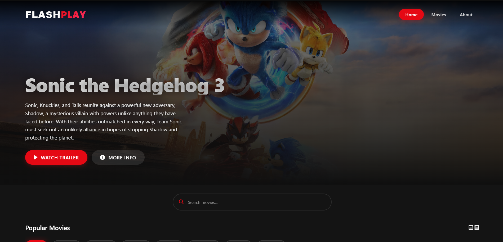

# 🎬 FlashPlay - Movie Trailer Website

  
  
  
  
  
  
  

## 📖 Tentang FlashPlay

FlashPlay adalah platform streaming trailer film modern yang memungkinkan pengguna untuk menjelajahi dan menonton trailer film terbaru dengan tampilan yang menarik dan responsif. Website ini menggunakan TMDB API untuk mendapatkan data film terkini.

## 🌟 Fitur Utama

- **🎯 Hero Section Dinamis**

  - Menampilkan film unggulan secara otomatis
  - Background yang menarik dan responsif
  - Informasi film lengkap

- **🎬 Katalog Film**

  - Grid layout yang modern
  - Hover effects yang smooth
  - Rating dan tahun rilis film
  - Poster film berkualitas tinggi

- **🔍 Pencarian Real-time**

  - Pencarian instan saat mengetik
  - Hasil yang akurat dari TMDB database
  - Filter berdasarkan kategori

- **🎥 Trailer Modal**
  - Pemutaran trailer yang mulus
  - Kontrol video lengkap
  - Autoplay dengan mute default
  - Tampilan fullscreen

## 💻 Teknologi yang Digunakan

- **Frontend:**

  - HTML5 & CSS3
  - Vanilla JavaScript
  - Font Awesome Icons
  - Google Fonts

- **Backend:**

  - Node.js & Express.js
  - CORS untuk keamanan
  - Dotenv untuk konfigurasi

- **API & Services:**
  - TMDB (The Movie Database) API
  - YouTube Embedded Player

## 📋 Persyaratan Sistem

- Node.js (v14.0.0 atau lebih baru)
- NPM (v6.0.0 atau lebih baru)
- XAMPP/Apache Server
- Web Browser Modern (Chrome, Firefox, Edge)
- Koneksi Internet Stabil
- TMDB API Key

## 🚀 Panduan Instalasi

### 1. Clone Repository

bash
git clone https://github.com/yourusername/flashplay.git
cd flashplay

### 2. Setup Backend

bash
cd backend
npm install

### 3. Konfigurasi Environment

- Copy file `.env.example` menjadi `.env`
- Isi TMDB API key Anda:

bash
TMDB_API_KEY=your_api_key_here
PORT=5000

### 4. Jalankan Aplikasi

**Backend:**

bash
cd backend
npm start
Server akan berjalan di http://localhost:5000

**Frontend:**

- Copy folder `frontend` ke direktori XAMPP:

bash
cp -r frontend C:/xampp/htdocs/flashplay/

- Start Apache di XAMPP Control Panel
- Buka `http://localhost/flashplay/frontend`

## 🎮 Cara Penggunaan

1. **Browsing Film**

   - Scroll halaman untuk melihat film populer
   - Klik film untuk melihat detail dan trailer
   - Gunakan kategori untuk filter film

2. **Pencarian Film**

   - Ketik judul film di search bar
   - Hasil akan muncul secara otomatis
   - Klik film yang diinginkan

3. **Menonton Trailer**
   - Klik film untuk membuka modal
   - Trailer akan autoplay (muted)
   - Gunakan kontrol video untuk pengaturan

## ⚠️ Troubleshooting

### Masalah Backend

- **Port 5000 sudah digunakan:**
  bash

  # Ganti port di .env

  PORT=5001

- **API Key Invalid:**
  - Periksa API key di .env
  - Pastikan TMDB account aktif

### Masalah Frontend

- **Loading Terus:**

  - Periksa console browser (F12)
  - Pastikan backend berjalan
  - Cek URL API di main.js

- **Trailer Tidak Muncul:**
  - Izinkan autoplay di browser
  - Periksa koneksi internet
  - Refresh halaman

## 📱 Responsive Design

Website ini responsif untuk:

- Desktop (1200px+)
- Tablet (768px - 1199px)
- Mobile (320px - 767px)

## 🔒 Keamanan

- CORS protection
- API Key tersembunyi di backend
- Sanitasi input pencarian
- Error handling yang aman

## 📞 Dukungan & Kontak

- **Email:** your.email@example.com
- **Discord:** your_discord
- **GitHub Issues:** [Create New Issue](https://github.com/yourusername/flashplay/issues)

## 🔄 Update & Maintenance

- Update dependencies secara berkala
- Backup data penting
- Monitor error logs
- Periksa API rate limits

## 📜 Lisensi

Proyek ini dilisensikan di bawah MIT License. Lihat file [LICENSE](LICENSE) untuk detail.

## 🙏 Acknowledgments

- TMDB untuk API film
- Font Awesome untuk icons
- Google Fonts untuk typography
- Komunitas open source

---

  Made with ❤️ by [Wahyu Diva](https://www.instagram.com/whyudivaaa/)
  
  [GitHub](https://github.com/yourusername) • [LinkedIn](https://linkedin.com/in/yourusername) • [Twitter](https://twitter.com/yourusername) • [Instagram]((https://www.instagram.com/whyudivaaa/))

